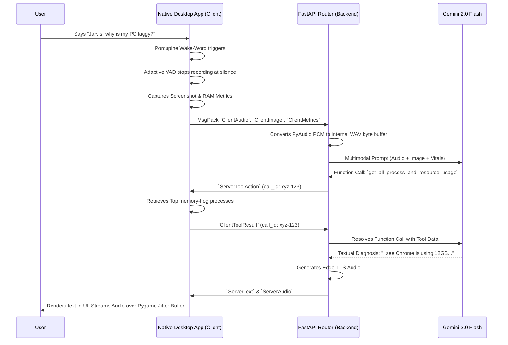

# 🛡️ System Caretaker

**System Caretaker** is an advanced, highly resilient, Copilot-style Native Desktop Application. It acts as an automatic system operator that proactively monitors your system vitals, listens to text and voice input with local wake-word detection, and leverages the **Google Gemini Multimodal API** to diagnose issues and confidently execute system-level fixes directly on your OS.

---

## 🏗️ Architecture Stack

System Caretaker is built on a split architecture to separate heavy AI orchestration and routing from the local OS-level monitoring application.

### 1. The Native Desktop App (The Local Operator)
A lightweight daemon and GUI running locally on the system you want to manage.
* **UI**: `CustomTkinter` providing a sleek text/chat interface and a live "Debug Feed" to visually monitor system health, screenshots, and agent decisions.
* **Hardware Telemetry**: Background threads utilizing `psutil` and `Pillow` to constantly sample RAM, CPU, Disk, and gather desktop screenshots without freezing the main UI.
* **Audio Pipeline**: Real-time `PyAudio` ingestion using `pvporcupine` for offline wake-word (`"Jarvis"`) detection, complete with an adaptive VAD (Voice Activity Detection) algorithm to parse human speech from background static.
* **Local Tools Execution**: Secure wrapper functions mapped to native OS commands (`psutil`, `subprocess`) to execute actions securely on behalf of the AI.

### 2. The Cloud Backend (The Brain)
A scalable `FastAPI` service hosting persistent WebSockets and acting as the middleman between the Native App and the AI framework.
* **Comms**: High-performance Binary WebSockets marshaling data instantly using `MsgPack`.
* **Routing**: Parses inbound Multimodal packets (System Spikes, Text, Audio, Images) and formats them into strict schema contexts for Gemini.
* **AI Engine**: Powered by `google-genai` utilizing `gemini-2.0-flash` by default (configurable via `GEMINI_MODEL`).
* **Output Generation**: Employs `edge-tts` to generate rapid audio responses from the LLM’s text streams back to the client.

---

## 🌊 Pipeline & Data Flow

System Caretaker's architecture relies on strict asynchronous contracts to proxy interactions between the OS and the cloud. 



---

## 🛠️ Tools & Ingestion

To prevent the LLM from hallucinating destructive shell scripts, the application implements a Sandbox strategy. The Backend only holds the **JSON Schemas** defining what the tools do (which it embeds into Gemini's context window). 

The Local App holds the **Execution Logic**. 

When Gemini decides a tool is necessary, it constructs a payload specifying the name and parameters. The backend wraps this in a unique `call_id` and forwards it via WebSocket down to the Native Desktop App. The App executes the Python function (e.g., `psutil.Process(pid).kill()`) and routes the output back to the cloud using the exact `call_id`.

**Supported Capabilities:**
* System Health & Top Processes Discovery
* Display Screenshot Capture
* Safely Terminating Processes (e.g. Chrome Tab management)
* Focus Environment Management (DND mode toggling, closing distracting apps)
* Graphics Server Restarting & Log parsing

---

## 🚀 Setup & Installation

### Prerequisites
* Python 3.12+
* Linux / Debian Environment (Audio Drivers like ALSA/PulseAudio required)
* [Picovoice Porcupine Access Key](https://picovoice.ai/console/)
* [Google Gemini API Key](https://aistudio.google.com/)

### 1. Clone & Install
```bash
git clone https://github.com/your-username/system-caretaker.git
cd system-caretaker

# It is highly recommended to use a virtual environment or `uv`
uv venv
source .venv/bin/activate

uv pip install -r requirements.txt
```

### 2. Configure Environment Secrets
Create a `.env` file in the root directory:
```env
GEMINI_API_KEY="AIzaSy...your-gemini-key"
GEMINI_MODEL="gemini-2.0-flash"
PICOVOICE_ACCESS_KEY="your-picovoice-porcupine-key"
```

### 3. Run the Services

You will need two terminal instances. First, start the Brain:
```bash
# Terminal 1 - Cloud Backend 
uv run uvicorn backend.main:app
```

Then, initialize the Watcher GUI:
```bash
# Terminal 2 - Native Desktop App
uv run python app/main.py
```

### 4. Interact!
* Say: **"Jarvis"** followed by your query.
* Or, simply type a manual command in the Chat Interface.

---

## 🎬 Hackathon Use Cases

Try out these primary flows designed for the demonstration:

1. **Context-Aware Slowdown:** Open several heavy browser tabs, trigger Jarvis and ask *"Why is my PC lagging?"*. The agent will ingest the screenshot and stats, and offer to suspend the exact tabs hoarding your RAM.
2. **Silent Saboteur (Logs):** Crash a mocked video application, and state proactively: *"My video player just closed!"*. Caretaker will immediately scan system logs, find the graphics driver crash, and restart the target service.
3. **Interrupted Study Session:** Ask Jarvis to *"Get ready for study"*. As it begins shutting down distracting apps, interrupt it: *"Wait, don't close Spotify!"*. The UI will instantly drop the tool action and modify its focus logic mid-execution.